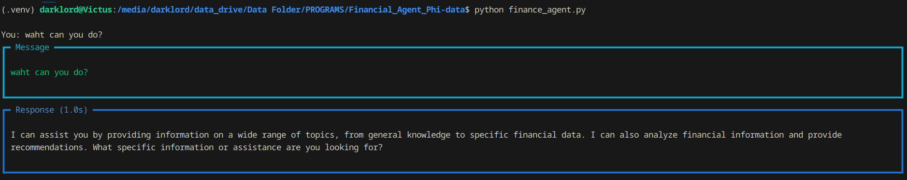
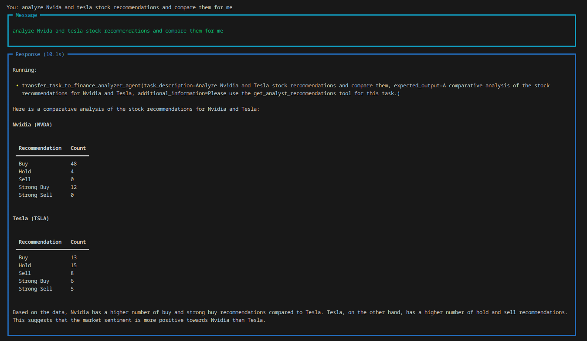

# Financial Analyst Agent

A simple Financial Agent having a team of **financial analyst** & a **web search agent**. Build using [**Phidata**](https://docs.phidata.com/introduction) Agent framework.

It's just a demo application while i was exploring [Phidata](https://docs.phidata.com/introduction).

### Images




### Run Locally

1. Clone the repository:
    ```sh
    git clone https://github.com/phidata/finance-agent.git
    cd finance-agent
    ```
2. Create and activate a virtual environment:
    ```py
    python -m venv .venv
    source .venv/bin/activate # As linux
    ```
3. Install the requirements:
   ```py
   pip install uv # Using UV
   uv pip install -r requirements.txt
    ```

4. Run the agent: 
    ```py
    python finance_agent.py
    ```
